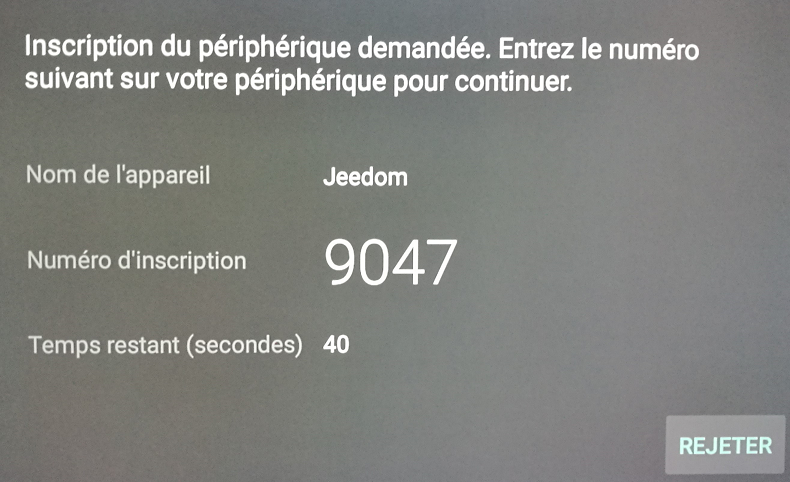

Présentation
===
Plugin de communication avec les TV Sony Bravia pour la solution domotique Jeedom

Configuration du plugin
===
Après téléchargement du plugin, il vous suffit juste d'activer celui-ci, il n'y a aucune configuration à ce niveau.

## Configuration des équipements

La configuration des équipements TV Sony est accessible à partir du menu plugin puis multimédia :

Vous retrouvez ici toute la configuration de votre équipement :

* Nom de l'équipement Mode : nom de votre équipement Mode,
* Objet parent : indique l'objet parent auquel appartient l'équipement,
* Activer : permet de rendre votre équipement actif,
* Visible : rend votre équipement visible sur le dashboard,
* Catégorie : les catégories de l'équipement (il peut appartenir à plusieurs catégories).
* Adresse IP : Adresse IP de la télévision
* Adresse MAC : Adresse MAC de la télévision au format 00:00:00:00:00:00. Il est possible de la retrouver dans le menu info de la télévision, sur l'interface d'administration de votre routeur ou bien sur l'étiquette derrière le téléviseur.
* Clé TV : Clé de sécurité renseignée sur la télévision ou bien code pin renseigné lors de la procédure d'association.

## Association

Deux modes de communications peuvent êtres utilisés.

* Usage d'une clé partagée (préféré)
* Association à l'aide d'un PIN code

### Clé partagée

** Activer l'accès distant sur votre TV : [Paramètres] => [Réseaux] => [Configuration Réseau domestique] => [Contrôle IP] => [On]
** Activer l'accès par clé partagée : [Paramètres] => [Réseaux] => [Configuration Réseau domestique] => [Contrôle IP] => [Authentification] => [Normal et clé pré-partagée]
** Choisir la clé et la renseigner ci-dessus : [Paramètres] => [Réseaux] => [Configuration Réseau domestique] => [Contrôle IP] => [Clé pré-partagée] => sony

### Pin code

Renseigner l'adresse ip et mac sur l'équipement, sauvegarder puis exécuter le processus d'association :

Suivre les indications ensuite.

Commandes
===
Exemple de commandes diponibles :

## Commandes régulières

## Commandes RAW

Il est possible d'envoyer des commandes non implémentées dans le plugin au moyen d'une commande RAW :

## Liste non exhaustive

|Nom|Code|
|---|----|
|	Num1	|	AAAAAQAAAAEAAAAAAw== |
|	Num2	|	AAAAAQAAAAEAAAABAw== |
|	Num3	|	AAAAAQAAAAEAAAACAw== |
|	Num4	|	AAAAAQAAAAEAAAADAw== |
|	Num5	|	AAAAAQAAAAEAAAAEAw== |
|	Num6	|	AAAAAQAAAAEAAAAFAw== |
|	Num7	|	AAAAAQAAAAEAAAAGAw== |
|	Num8	|	AAAAAQAAAAEAAAAHAw== |
|	Num9	|	AAAAAQAAAAEAAAAIAw== |
|	Num0	|	AAAAAQAAAAEAAAAJAw== |
|	Num11	|	AAAAAQAAAAEAAAAKAw== |
|	Num12	|	AAAAAQAAAAEAAAALAw== |
|	Enter	|	AAAAAQAAAAEAAAALAw== |
|	GGuide	|	AAAAAQAAAAEAAAAOAw== |
|	ChannelUp	|	AAAAAQAAAAEAAAAQAw== |
|	ChannelDown	|	AAAAAQAAAAEAAAARAw== |
|	VolumeUp	|	AAAAAQAAAAEAAAASAw== |
|	VolumeDown	|	AAAAAQAAAAEAAAATAw== |
|	Mute	|	AAAAAQAAAAEAAAAUAw== |
|	TvPower	|	AAAAAQAAAAEAAAAVAw== |
|	Audio	|	AAAAAQAAAAEAAAAXAw== |
|	MediaAudioTrack	|	AAAAAQAAAAEAAAAXAw== |
|	Tv	|	AAAAAQAAAAEAAAAkAw== |
|	Input	|	AAAAAQAAAAEAAAAlAw== |
|	TvInput	|	AAAAAQAAAAEAAAAlAw== |
|	TvAntennaCable	|	AAAAAQAAAAEAAAAqAw== |
|	WakeUp	|	AAAAAQAAAAEAAAAuAw== |
|	PowerOff	|	AAAAAQAAAAEAAAAvAw== |
|	Sleep	|	AAAAAQAAAAEAAAAvAw== |
|	Right	|	AAAAAQAAAAEAAAAzAw== |
|	Left	|	AAAAAQAAAAEAAAA0Aw== |
|	SleepTimer	|	AAAAAQAAAAEAAAA2Aw== |
|	Analog2	|	AAAAAQAAAAEAAAA4Aw== |
|	TvAnalog	|	AAAAAQAAAAEAAAA4Aw== |
|	Display	|	AAAAAQAAAAEAAAA6Aw== |
|	Jump	|	AAAAAQAAAAEAAAA7Aw== |
|	PicOff	|	AAAAAQAAAAEAAAA+Aw== |
|	PictureOff	|	AAAAAQAAAAEAAAA+Aw== |
|	Teletext	|	AAAAAQAAAAEAAAA\/Aw== |
|	Video1	|	AAAAAQAAAAEAAABAAw== |
|	Video2	|	AAAAAQAAAAEAAABBAw== |
|	AnalogRgb1	|	AAAAAQAAAAEAAABDAw== |
|	Home	|	AAAAAQAAAAEAAABgAw== |
|	Exit	|	AAAAAQAAAAEAAABjAw== |
|	PictureMode	|	AAAAAQAAAAEAAABkAw== |
|	Confirm	|	AAAAAQAAAAEAAABlAw== |
|	Up	|	AAAAAQAAAAEAAAB0Aw== |
|	Down	|	AAAAAQAAAAEAAAB1Aw== |
|	ClosedCaption	|	AAAAAgAAAKQAAAAQAw== |
|	Component1	|	AAAAAgAAAKQAAAA2Aw== |
|	Component2	|	AAAAAgAAAKQAAAA3Aw== |
|	Wide	|	AAAAAgAAAKQAAAA9Aw== |
|	EPG	|	AAAAAgAAAKQAAABbAw== |
|	PAP	|	AAAAAgAAAKQAAAB3Aw== |
|	TenKey	|	AAAAAgAAAJcAAAAMAw== |
|	BSCS	|	AAAAAgAAAJcAAAAQAw== |
|	Ddata	|	AAAAAgAAAJcAAAAVAw== |
|	Stop	|	AAAAAgAAAJcAAAAYAw== |
|	Pause	|	AAAAAgAAAJcAAAAZAw== |
|	Play	|	AAAAAgAAAJcAAAAaAw== |
|	Rewind	|	AAAAAgAAAJcAAAAbAw== |
|	Forward	|	AAAAAgAAAJcAAAAcAw== |
|	DOT	|	AAAAAgAAAJcAAAAdAw== |
|	Rec	|	AAAAAgAAAJcAAAAgAw== |
|	Return	|	AAAAAgAAAJcAAAAjAw== |
|	Blue	|	AAAAAgAAAJcAAAAkAw== |
|	Red	|	AAAAAgAAAJcAAAAlAw== |
|	Green	|	AAAAAgAAAJcAAAAmAw== |
|	Yellow	|	AAAAAgAAAJcAAAAnAw== |
|	SubTitle	|	AAAAAgAAAJcAAAAoAw== |
|	CS	|	AAAAAgAAAJcAAAArAw== |
|	BS	|	AAAAAgAAAJcAAAAsAw== |
|	Digital	|	AAAAAgAAAJcAAAAyAw== |
|	Options	|	AAAAAgAAAJcAAAA2Aw== |
|	Media	|	AAAAAgAAAJcAAAA4Aw== |
|	Prev	|	AAAAAgAAAJcAAAA8Aw== |
|	Next	|	AAAAAgAAAJcAAAA9Aw== |
|	DpadCenter	|	AAAAAgAAAJcAAABKAw== |
|	CursorUp	|	AAAAAgAAAJcAAABPAw== |
|	CursorDown	|	AAAAAgAAAJcAAABQAw== |
|	CursorLeft	|	AAAAAgAAAJcAAABNAw== |
|	CursorRight	|	AAAAAgAAAJcAAABOAw== |
|	ShopRemoteControlForcedDynamic	|	AAAAAgAAAJcAAABqAw== |
|	FlashPlus	|	AAAAAgAAAJcAAAB4Aw== |
|	FlashMinus	|	AAAAAgAAAJcAAAB5Aw== |
|	DemoMode	|	AAAAAgAAAJcAAAB8Aw== |
|	Analog	|	AAAAAgAAAHcAAAANAw== |
|	Mode3D	|	AAAAAgAAAHcAAABNAw== |
|	DigitalToggle	|	AAAAAgAAAHcAAABSAw== |
|	DemoSurround	|	AAAAAgAAAHcAAAB7Aw== |
|	{"name":"*AD	|	AAAAAgAAABoAAAA7Aw== |
|	AudioMixUp	|	AAAAAgAAABoAAAA8Aw== |
|	AudioMixDown	|	AAAAAgAAABoAAAA9Aw== |
|	PhotoFrame	|	AAAAAgAAABoAAABVAw== |
|	Tv_Radio	|	AAAAAgAAABoAAABXAw== |
|	SyncMenu	|	AAAAAgAAABoAAABYAw== |
|	Hdmi1	|	AAAAAgAAABoAAABaAw== |
|	Hdmi2	|	AAAAAgAAABoAAABbAw== |
|	Hdmi3	|	AAAAAgAAABoAAABcAw== |
|	Hdmi4	|	AAAAAgAAABoAAABdAw== |
|	TopMenu	|	AAAAAgAAABoAAABgAw== |
|	PopUpMenu	|	AAAAAgAAABoAAABhAw== |
|	OneTouchTimeRec	|	AAAAAgAAABoAAABkAw== |
|	OneTouchView	|	AAAAAgAAABoAAABlAw== |
|	DUX	|	AAAAAgAAABoAAABzAw== |
|	FootballMode	|	AAAAAgAAABoAAAB2Aw== |
|	iManual	|	AAAAAgAAABoAAAB7Aw== |
|	Netflix	|	AAAAAgAAABoAAAB8Aw== |
|	Assists	|	AAAAAgAAAMQAAAA7Aw== |
|	FeaturedApp	|	AAAAAgAAAMQAAABEAw== |
|	FeaturedAppVOD	|	AAAAAgAAAMQAAABFAw== |
|	GooglePlay	|	AAAAAgAAAMQAAABGAw== |
|	ActionMenu	|	AAAAAgAAAMQAAABLAw== |
|	Help	|	AAAAAgAAAMQAAABNAw== |
|	TvSatellite	|	AAAAAgAAAMQAAABOAw== |
|	WirelessSubwoofer	|	AAAAAgAAAMQAAAB+Aw== |
|	AndroidMenu	|	AAAAAgAAAMQAAABPAw== |

Compatibilités testées :
===
* KDL-50W829B
* KDL-42W705B
* KDL-55W805C
* KD-55X9005B
* KDL-42W805A
* KDL-60W605B
* KDL-42W650A
* KD-49XD8305 Android
* KD-55X8509C Android
* KD-55SD8505 Android
* KD-55XD8505 Android
* KD-55XD8005 Android
* KDL-50W755c Android
* XBR-43X800D Android

Bug
===
En cas de bug avéré du plugin il est possible d'ouvrir une issue :

[https://github.com/Jeedom-Plugins-Extra/plugin-sony-bravia/issues](https://github.com/Jeedom-Plugins-Extra/plugin-sony-bravia/issues)
